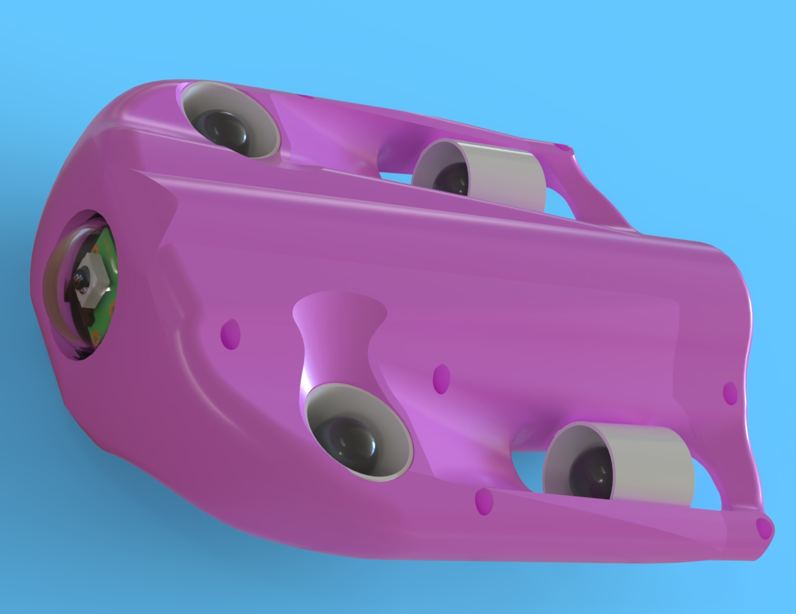
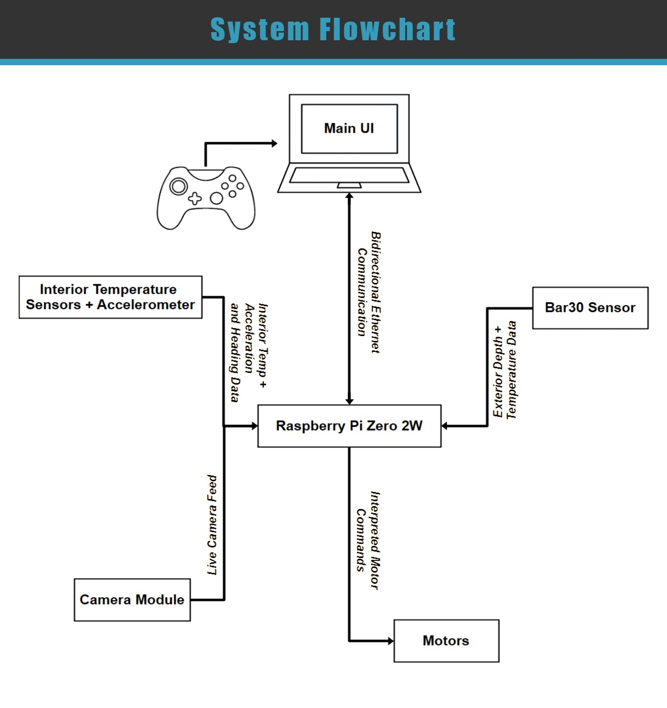
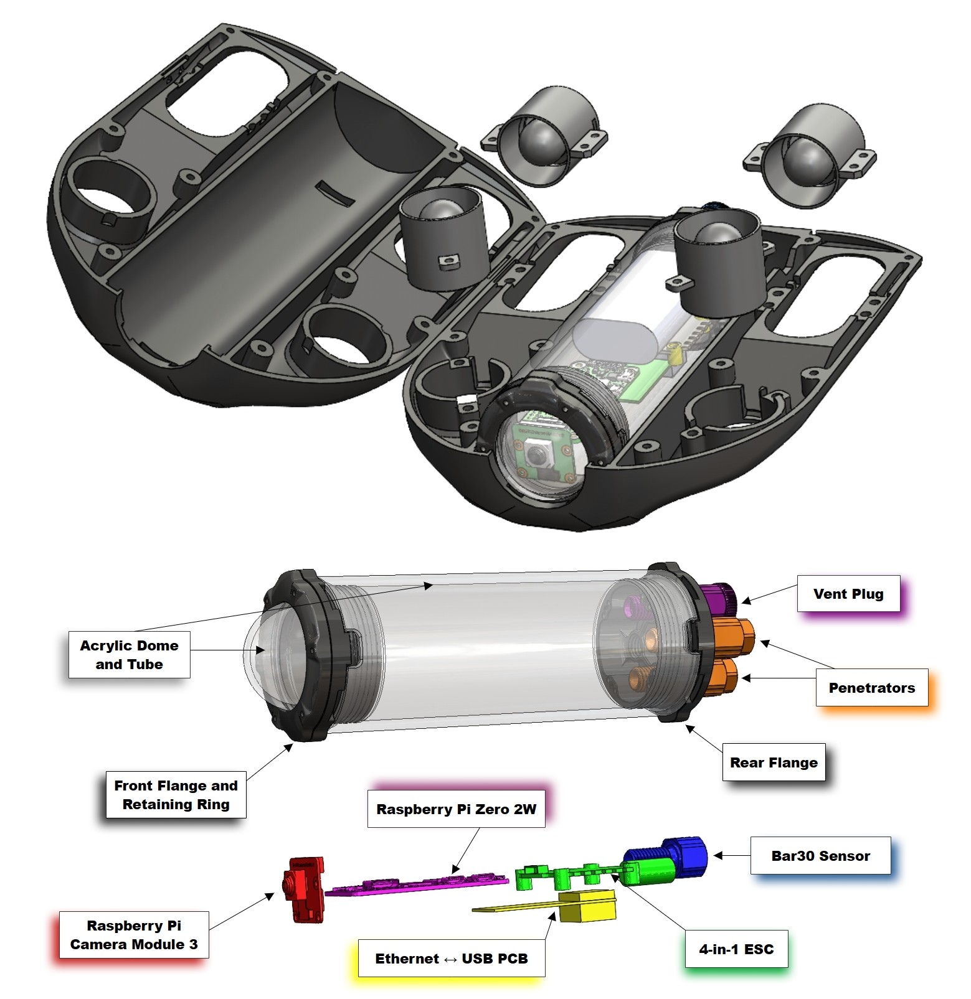

  

# Technical Details
23.5cm Long X 11cm Wide  
100ft depth rating  
Low-Latency Live Camera View  
Intuitive Control with an Xbox360 Controller 
Temperature and Depth Monitoring
Tethered Via Ethernet

# Introduction
Remotely operated vehicles (ROVs) are widely used for underwater research, inspection, and exploration; however, many commercially available systems remain prohibitively expensive for small research teams, educational institutions, and independent developers. This project explores the feasibility of designing and developing a cost-effective, remotely operated submersible capable of supporting underwater exploration while maintaining essential functionality and reliability.  
The system consists of a tethered ROV that provides four-axis maneuverability and a real-time first-person-view (FPV) video feed for navigation and situational awareness. Communication between the submersible and the surface control station is achieved through an Ethernet tether, enabling bidirectional control signals and continuous live video transmission.  
The project integrates mechanical design, electrical system development, and embedded software to implement propulsion control, sensor monitoring, and remote operation. Testing demonstrates that the vehicle is capable of stable maneuvering and reliable communication with the surface station while delivering continuous video feedback for navigation.  
To promote accessibility and encourage further development, all design files, software, assembly documentation, and technical resources associated with this project are released as open-source materials. These resources allow others to replicate, modify, and expand upon the system using accessible components and tools.   

  
  

This Project is a Student Senior Capstone Project for the University of West FLorida, Hal Marcus College of Science and Engineering  
  

This Project was Funded and Supported by The HSU Family Educational Foundation Inc
